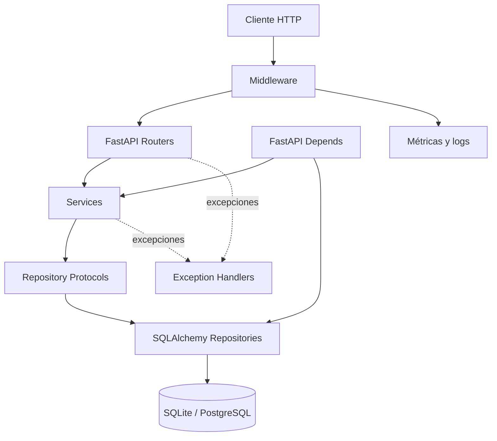

# SensorHub

[](https://github.com/angelreach91/sdlc-electronica-angel-libreros/actions/workflows/ci.yml)

SensorHub es una API REST desarrollada con FastAPI. Permite administrar sensores y lecturas, detectar anomalías, gestionar alertas, calcular estadísticas y consultar métricas básicas de observabilidad.

## Funcionalidades

- **RF-1 — Sensores:** crea, consulta y actualiza sensores con `id`, `name`, `location`, `sensor_type`, `unit`, `threshold` e `is_active`. La eliminación es una desactivación lógica.
- **RF-2 — Registro de lecturas:** comprueba que el sensor exista y esté activo, valida la unidad y los límites físicos, y almacena `received_at`.
- **RF-3 — Consulta de lecturas:** ofrece paginación con `limit` y `offset`, filtros `from` y `to`, y validación del rango temporal.
- **RF-4 — Detección de anomalías:** genera una alerta cuando una lectura supera el umbral configurado para el sensor.
- **RF-5 — Alertas:** permite consultar alertas por sensor o activas y avanzar su estado de `open` a `acknowledged` y después a `resolved`.
- **RF-6 — Estadísticas:** calcula mínimo, máximo y promedio en SQL para un sensor y un período obligatorio.
- **RF-7 — Observabilidad:** expone el estado del servicio, contadores de solicitudes y errores, tiempo de actividad y logs HTTP estructurados.

## Arquitectura



SensorHub se mantiene como un **monolito modular**, con responsabilidades separadas por capas:

- **Router:** capa HTTP que recibe solicitudes y delega cada operación.
- **Service:** contiene las reglas y la coordinación de negocio.
- **Repository Protocol:** define los contratos que necesitan los servicios y evita acoplarlos directamente a SQLAlchemy.
- **SQLAlchemy Repository:** implementa el acceso a los datos.
- **Database:** utiliza SQLite o PostgreSQL según el entorno.
- **FastAPI Depends:** construye e inyecta sesiones, repositorios y servicios.
- **Middleware:** centraliza la observabilidad, las métricas y el logging HTTP.
- **Exception Handlers:** traducen de forma centralizada los errores de aplicación a respuestas HTTP.

Los manejadores globales aplican este mapeo:

| Excepción | HTTP |
|---|---:|
| `ValueError` | `400` |
| `LookupError` | `404` |
| `SensorAlreadyExistsError` | `409` |
| `SQLAlchemyError` | `503` |
| `Exception` | `500` |

## Tecnologías

| Tecnología | Uso |
|---|---|
| FastAPI | API HTTP e inyección de dependencias |
| Pydantic | Validación y contratos de datos |
| SQLAlchemy 2.x | ORM, repositorios y agregaciones SQL |
| Alembic | Migraciones de base de datos |
| PostgreSQL 16 | Persistencia en Docker Compose y Render |
| SQLite | Persistencia local predeterminada y pruebas |
| Pytest | Pruebas y cobertura |
| Ruff | Análisis estático y estilo |
| Mypy | Comprobación de tipos |
| Docker | Imagen de la aplicación con Python 3.12 |
| Docker Compose | Orquestación local de API y PostgreSQL |
| GitHub Actions | Integración continua |
| Render | Despliegue de la API y PostgreSQL administrado |

## Estructura del proyecto

```text
app/
├── main.py
├── config.py
├── db.py
├── observability.py
├── alert_status.py
├── dependencies.py
├── exceptions.py
├── routers/
├── services/
├── repositories/
├── models/
└── schemas/

migrations/
tests/
docs/adr/
.github/workflows/ci.yml
AI_LOG.md
Dockerfile
docker-compose.yml
render.yaml
README.md
```

## Endpoints

### Sensores

| Método | Ruta | Operación |
|---|---|---|
| `POST` | `/sensors` | Crear un sensor |
| `GET` | `/sensors` | Listar sensores con `limit` y `offset` |
| `GET` | `/sensors/{sensor_id}` | Consultar un sensor |
| `PATCH` | `/sensors/{sensor_id}` | Actualizar un sensor |
| `DELETE` | `/sensors/{sensor_id}` | Desactivar un sensor |

### Lecturas

| Método | Ruta | Operación |
|---|---|---|
| `POST` | `/sensors/{sensor_id}/readings` | Registrar una lectura |
| `GET` | `/sensors/{sensor_id}/readings` | Listar lecturas con `limit`, `offset`, `from` y `to` |
| `GET` | `/readings/{reading_id}` | Consultar una lectura |
| `PATCH` | `/readings/{reading_id}` | Actualizar una lectura |
| `DELETE` | `/readings/{reading_id}` | Eliminar una lectura |

### Estadísticas

| Método | Ruta | Operación |
|---|---|---|
| `GET` | `/sensors/{sensor_id}/statistics` | Obtener `minimum`, `maximum` y `average`; requiere `from` y `to` |

### Alertas

| Método | Ruta | Operación |
|---|---|---|
| `GET` | `/sensors/{sensor_id}/alerts` | Listar alertas con paginación y filtros temporales |
| `GET` | `/alerts/active` | Listar alertas abiertas o reconocidas |
| `PATCH` | `/alerts/{alert_id}/status` | Cambiar el estado de una alerta |

### Observabilidad

| Método | Ruta | Operación |
|---|---|---|
| `GET` | `/health` | Comprobar la disponibilidad del servicio |
| `GET` | `/metrics` | Consultar `requests_total`, `errors_total` y `uptime_seconds` |

### Documentación

| Método | Ruta | Operación |
|---|---|---|
| `GET` | `/docs` | Abrir la documentación interactiva Swagger |

## Reglas de dominio

### Temperatura

- `sensor_type`: `temperature`
- `unit`: `C`
- valor mínimo: `-273.15`

### Humedad

- `sensor_type`: `humidity`
- `unit`: `%`
- rango permitido: `0` a `100`

También se rechazan valores no finitos, unidades incompatibles, lecturas para sensores inexistentes y lecturas para sensores desactivados.

### Anomalías

Si el sensor tiene umbral y se cumple:

```text
value > threshold
```

la lectura genera una alerta con estado inicial `open`.

### Estados de alerta

Las únicas transiciones válidas son:

```text
open -> acknowledged -> resolved
```

## Configuración

Crea el archivo local a partir de la plantilla versionada:

```bash
cp .env.example .env
```

No almacenes secretos reales en el repositorio. Docker Compose lee `.env` automáticamente; para una ejecución directa, las variables necesarias deben estar disponibles en el entorno del proceso.

| Variable | Uso |
|---|---|
| `APP_NAME` | Nombre mostrado por la aplicación |
| `APP_VERSION` | Versión mostrada por la aplicación |
| `LOG_LEVEL` | Nivel del logging estructurado |
| `DATABASE_URL` | Conexión de SQLAlchemy; si no existe, usa `sqlite:///./sensorhub.db` |
| `POSTGRES_USER` | Usuario de PostgreSQL utilizado principalmente por Docker Compose |
| `POSTGRES_PASSWORD` | Contraseña local de PostgreSQL utilizada principalmente por Docker Compose |
| `POSTGRES_DB` | Base de datos de PostgreSQL utilizada principalmente por Docker Compose |

La aplicación acepta URLs `sqlite`, `postgresql+psycopg`, `postgresql` y `postgres`; estas dos últimas se normalizan para usar el controlador `psycopg`.

## Ejecución local

Desde la raíz del repositorio:

```bash
python -m venv .venv
source .venv/bin/activate
python -m pip install -r requirements.txt
python -m alembic upgrade head
python -m uvicorn app.main:app --reload
```

La configuración predeterminada usa SQLite. Los recursos principales quedan disponibles en:

- API: <http://127.0.0.1:8000>
- Swagger: <http://127.0.0.1:8000/docs>
- Health: <http://127.0.0.1:8000/health>
- Metrics: <http://127.0.0.1:8000/metrics>

## Docker Compose

```bash
cp .env.example .env
docker compose up --build -d
docker compose ps
docker compose logs api
docker compose down
```

El servicio `api` ejecuta SensorHub y `db` ejecuta PostgreSQL 16. PostgreSQL cuenta con un healthcheck y la API espera a que alcance el estado `healthy`. Antes de iniciar Uvicorn, el contenedor de la API ejecuta `alembic upgrade head`. El volumen nombrado `pgdata` conserva los datos cuando los contenedores se recrean o se detienen con `docker compose down`.

El `Dockerfile` parte de Python 3.12-slim, instala `requirements.txt`, copia la aplicación y las migraciones, acepta `PORT` y aplica las migraciones antes de iniciar Uvicorn.

También se puede construir y ejecutar únicamente la imagen de la API con SQLite:

```bash
docker build -t sensorhub:dev .
docker run --rm -p 127.0.0.1:8000:8000 sensorhub:dev
```

## Migraciones

```bash
python -m alembic upgrade head
python -m alembic current
python -m alembic history
```

Alembic mantiene una cadena lineal que permite reproducir el esquema completo desde una base vacía. El único head actual es:

```text
b7f2c8d91e34
```

## Pruebas y calidad

```bash
python -m pytest
python -m ruff check app tests migrations
python -m mypy app
```

Estado final verificado:

```text
147 passed
95.48% coverage en WSL
95.69% coverage en Docker con Python 3.12
mínimo requerido: 80%
Ruff: All checks passed
Mypy: 0 errores en 30 archivos
```

La suite combina pruebas unitarias, de repositorios con SQLite temporal, HTTP con `TestClient` y de integración. Las bases temporales evitan modificar `sensorhub.db`.

## CI/CD

### CI — GitHub Actions

El workflow ejecuta este flujo con Python 3.12:

```text
Ruff -> Mypy -> Pytest
```

Se activa con cada `push` y con los pull requests cuyo destino es `main`.

### CD — Render

`render.yaml` define un servicio web con runtime Docker desde la rama `main`, un PostgreSQL 16 administrado y `/health` como healthcheck. Render tiene Auto-Deploy configurado con `checksPass`, por lo que despliega después de que los checks terminen satisfactoriamente.

## Producción

- [API](https://sensorhub-api-8yfj.onrender.com)
- [Health](https://sensorhub-api-8yfj.onrender.com/health)
- [Metrics](https://sensorhub-api-8yfj.onrender.com/metrics)
- [Swagger](https://sensorhub-api-8yfj.onrender.com/docs)

Los endpoints de verificación `/health`, `/metrics` y `/docs` fueron comprobados manualmente con respuesta HTTP `200`.

## Decisiones arquitectónicas

- [ADR 0001 — API con FastAPI y Pydantic](docs/adr/0001-api-fastapi-pydantic.md)
- [ADR 0002 — Persistencia con SQLAlchemy y SQLite](docs/adr/0002-persistencia-sqlalchemy-sqlite.md)
- [ADR 0003 — Arquitectura en capas y dependencias de FastAPI](docs/adr/0003-arquitectura-capas-dependencias-fastapi.md)
- [ADR 0004 — Monolito modular frente a microservicios](docs/adr/0004-monolito-modular-frente-a-microservicios.md)

## Uso de inteligencia artificial

El uso de IA durante el desarrollo se documenta en [AI_LOG.md](AI_LOG.md). La bitácora registra el objetivo, la herramienta o prompt, la propuesta recibida, la decisión tomada y la revisión humana.

## Historial del curso

El repositorio conserva ejercicios de semanas anteriores, como `semana1/` y `semana2/`, a modo de material histórico. SensorHub, dentro de `app/`, es el producto principal y este README describe su estado final.
